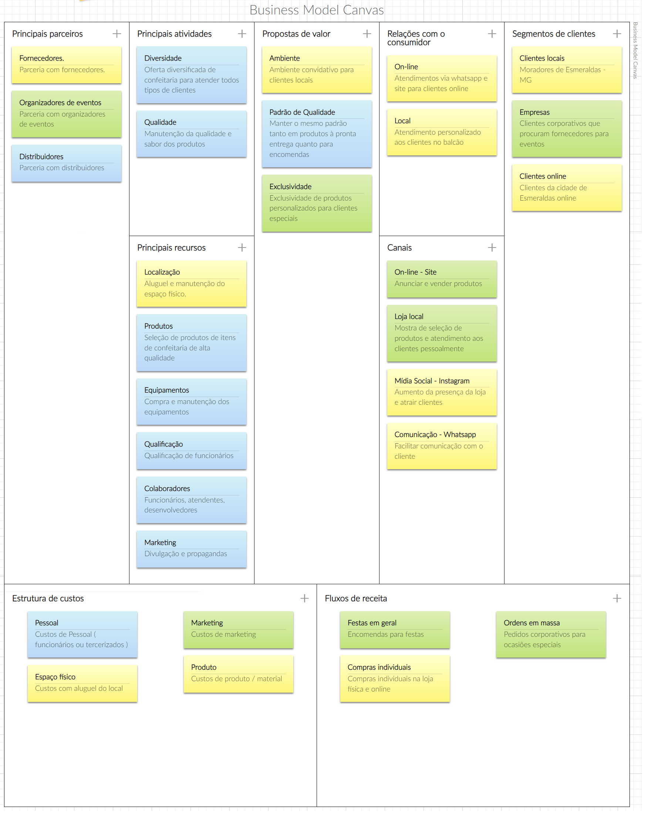

# Especificações do Projeto

Pré-requisitos: <a href="1-Documentação de Contexto.md"> Documentação de Contexto</a>

A definição exata do problema e os pontos mais relevantes a serem tratados neste projeto foi consolidada com a participação dos usuários através da entrevista com proprietário, atendente e cliente. Os detalhes levantados nesse processo estão consolidados na forma de personas e histórias de usuários e, as mudanças que possam ocorrer ao longo do caminho e do projeto devem adaptar-se de maneira organizada e segura para os envolvidos, acrescentando e retirando funcionalidades da lista, atribuindo novas prioridades e adicionando detalhes de acordo com o fornecimento dos feedbacks.

## Personas

As personas levantadas durante o processo de entendimento do problema são apresentadas nas Figuras que se seguem.

##  Flávia (cliente) 
 
 
 
 Fonte: depositphotos (2013)

**Idade** : 32 

**Ocupação**: Secretária durante os dias úteis e aos fins de semana realiza os serviços domésticos de sua casa.	

**Aplicativos**
-	Instagram 
-	Facebook 
-	WhatsApp 
-	Apps bancários 
 
**Motivações**
-	Gostaria de ter mais praticidade durante sua rotina atarefada, para que possa passar mais tempo ao lado dos filhos. 
-	Diversificação de Meios de pagamento. 
-	Praticidade na visualização dos produtos. 

**Frustrações**
-	Atualmente gostaria de organizar uma festa, entretanto, os preparativos demandam muito tempo. 
-	Não gosta de doce com fruta. 
-	Falta de informações de fácil acesso sobre o produto. 	

**Hobbies, História**
-	Tem 2 filhos. 
-	Costuma usar as redes sociais com frequência. 

##  Ana Diniz (Proprietária) 

Fonte: Acervo Pessoal

**Idade**: 43 

**Ocupação**: Administrada de empresas (Comércio Exterior); professora de inglês; proprietária de uma pequena doceria na região metropolitana de Minas Gerais que atua em proporcionar experiências a seus usuários. 

**Aplicativos**
-	Instagram 
-	Facebook 
-	WhatsApp 
-	Aplicativo de banco 
-	Canva 

**Motivações**
-	Aumentar a clientela.
-	Padronizar solicitações de pedidos.
-	Organizar e mitigar as entregas. 
-	Emissão de relatórios pra gerenciamento do negócio.

**Frustrações** 
-	Não conseguir atender seu cliente em único meio on-line. 
-	Não ter visibilidade da parte gerencial do projeto. 

**Hobbies, História**
-	Tem personalidade forte, empreendedora. Gosta de dar aula e lidar com os jovens. 

## Alexandre (Atendente) 

**Idade**: 22 anos

**Ocupação**: Atendente 

**Aplicativos**
- Facebook 
- WhatsApp 
- Instagram  
- Tik Tok 
- You Tube 

**Motivações**
- Atender os pedidos de forma mais ágil. 
- Confiabilidade na empresa.
- Assertividade nos pedidos.
- Clareza nas informações.
- Alerta de chegada do pedido.

**Frustrações**
- Quantidade elevada de pedidos.
- Dificuldade em separar os pedidos. 
- Ordem dos Pedidos. 
	
**Hobbies, História**
•	Aventureira, gosta de curtir a vida, pessoa ágil e bem resolvida. 

## Histórias de Usuários

A partir da compreensão do dia a dia das personas identificadas para o projeto, foram registradas as seguintes histórias de usuários.

|EU COMO... `PERSONA`| QUERO/PRECISO ... `FUNCIONALIDADE` |PARA ... `MOTIVO/VALOR`                 |
|--------------------|------------------------------------|----------------------------------------|
|Flávia (Cliente)  |Visualizar, selecionar, comprar e pedir entrega em domicílio, doces para uma festa  | Para que possa poupar tempo e priorizar outras tarefas               |
|Flávia (Cliente)  | Realizar uma alteração no prato/pedido | Para que atenda às suas preferências |
|Flávia (Cliente)  | Desejo um cardápio claro, um site esclarecedor e simples| Não posso perder tempo, pois minha rotina é muito corrida|
|Flávia (Cliente)  | Ter formas de pagamento variadas| Para que possa escolher a melhor opção|
|Ana Diniz (Proprietário)  | Conseguir atender mais de um cliente em um único meio on-line| Potencializar as vendas, atendendo mais de um cliente em único meio on-line|
|Ana Diniz (Proprietário)  | Ter visibilidade de dados centralizados de vendas realizadas na plataforma| Para que a partir de dados, poder fazer um cálculo preciso de estoque de itens mais pedidos e direcionar melhor as campanhas de marketing|
|Ana Diniz (Proprietário)  | Aplicação que permita interação com o cliente| Para permitir fidelização e melhorias|
|Ana Diniz (Proprietário)  | Aplicação que permita mostrar ao cliente a quantidade de disponibilidade de determinados produtos| Para que o cliente visualize a disponibilidade do produtos|
|Alexandre (Atendente)  | Gerenciar quantidade elevadas de pedidos| Para organizar recursos e tempo ao separar os pedidos com mais agilizados|
|Alexandre (Atendente)  | Conseguir separar os pedidos com mais agilidade| Para diminuir o tempo gasto com logística entre o momento do pedido ao destino do produto|
|Alexandre (Atendente)  | Ter ordenação de pedidos por prioridade, ordem de chegada, local de entrega| Para as prioridades de pedidos serem respeitados na hora de preparar/organizar pedidos|

## Arquitetura e Tecnologias

o	Descreva brevemente a arquitetura definida para o projeto e as tecnologias a serem utilizadas. Sugere-se a criação de um diagrama de componentes da solução.

## Project Model Canvas

Abaixo ilustração com o quadro Business Model Canvas apresentando os noves blocos e abordando como a emprese pretende atuar e gerar valor para seus clientes. Quadro desenvolvido no canvanizer.com

## Requisitos

As tabelas que se seguem apresentam os requisitos funcionais e não funcionais que detalham o escopo do projeto. Para determinar a prioridade de requisitos, aplicar uma técnica de priorização de requisitos e detalhar como a técnica foi aplicada.

### Requisitos Funcionais

|ID    | Descrição do Requisito  | Prioridade |
|------|-----------------------------------------|----|
| RF-001 | O sistema deverá permitir a criação de um perfil de usuário.  | ALTA | 
| RF-002 | O sistema deverá permitir a alteração e a exclusão dos dados de usuários.   | ALTA | 
| RF-003 | O sistema deverá permitir armazenar os produtos. | ALTA |
| RF-004 | O sistema deverá permitir a edição e a exclusão dos produtos.    | MÉDIA |
| RF-005 | O sistema deverá permitir a busca de produtos com a opção de filtrar sua pesquisa. | ALTA |
| RF-006 | o sistema deverá permitir a opção de salvar a receita escolhida.  | BAIXA |
### Requisitos não Funcionais

|ID     | Descrição do Requisito  |Prioridade |
|-------|-------------------------|----|
| RNF-001 | A aplicação deve ser compatível com sistemas Android e iOS. | ALTA | 
| RNF-002 | A aplicação deve ser compatível com os principais navegadores Web. | ALTA |
| RNF-003 | O projeto deverá ser implementado com um banco de dados NoSQL. |  MÉDIA |
| RNF-004 | O sistema deve processar requisições do usuário em no máximo 11 segundos. |  BAIXA |
| RNF-005 | O sistema deve ser responsivo para rodar em um dispositivos móvel | MÉDIA |

Com base nas Histórias de Usuário, enumere os requisitos da sua solução. Classifique esses requisitos em dois grupos:

- [Requisitos Funcionais
 (RF)](https://pt.wikipedia.org/wiki/Requisito_funcional):
 correspondem a uma funcionalidade que deve estar presente na
  plataforma (ex: cadastro de usuário).
- [Requisitos Não Funcionais
  (RNF)](https://pt.wikipedia.org/wiki/Requisito_n%C3%A3o_funcional):
  correspondem a uma característica técnica, seja de usabilidade,
  desempenho, confiabilidade, segurança ou outro (ex: suporte a
  dispositivos iOS e Android).
Lembre-se que cada requisito deve corresponder à uma e somente uma
característica alvo da sua solução. Além disso, certifique-se de que
todos os aspectos capturados nas Histórias de Usuário foram cobertos.

## Restrições

O projeto está restrito pelos itens apresentados na tabela a seguir.

|ID| Restrição                                             |
|--|-------------------------------------------------------|
|01| O projeto deverá ser entregue até o final do semestre |
|02| Não pode ser desenvolvido um módulo de backend        |

Enumere as restrições à sua solução. Lembre-se de que as restrições geralmente limitam a solução candidata.

> **Links Úteis**:
> - [O que são Requisitos Funcionais e Requisitos Não Funcionais?](https://codificar.com.br/requisitos-funcionais-nao-funcionais/)
> - [O que são requisitos funcionais e requisitos não funcionais?](https://analisederequisitos.com.br/requisitos-funcionais-e-requisitos-nao-funcionais-o-que-sao/)

## Diagrama de Casos de Uso

O diagrama abaixo ilustra as principais ligações entre casos de uso e os atores relacionados aos requisitos funcionais levantados para o projeto.

## Modelo ER (Projeto Conceitual)

O Modelo ER representa através de um diagrama como as entidades (coisas, objetos) se relacionam entre si na aplicação interativa.

Sugestão de ferramentas para geração deste artefato: LucidChart e Draw.io.

A referência abaixo irá auxiliá-lo na geração do artefato “Modelo ER”.

> - [Como fazer um diagrama entidade relacionamento | Lucidchart](https://www.lucidchart.com/pages/pt/como-fazer-um-diagrama-entidade-relacionamento)

## Projeto da Base de Dados

O projeto da base de dados corresponde à representação das entidades e relacionamentos identificadas no Modelo ER, no formato de tabelas, com colunas e chaves primárias/estrangeiras necessárias para representar corretamente as restrições de integridade.
