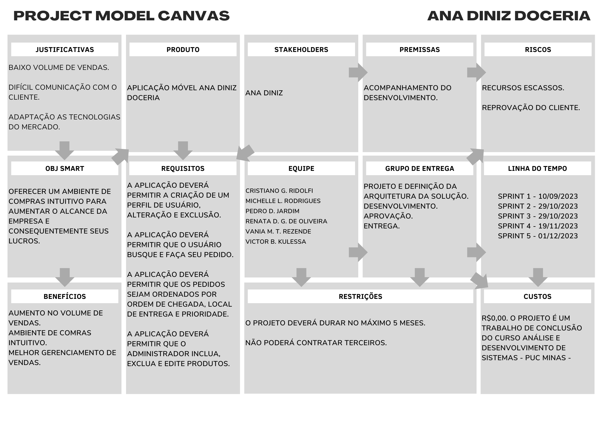
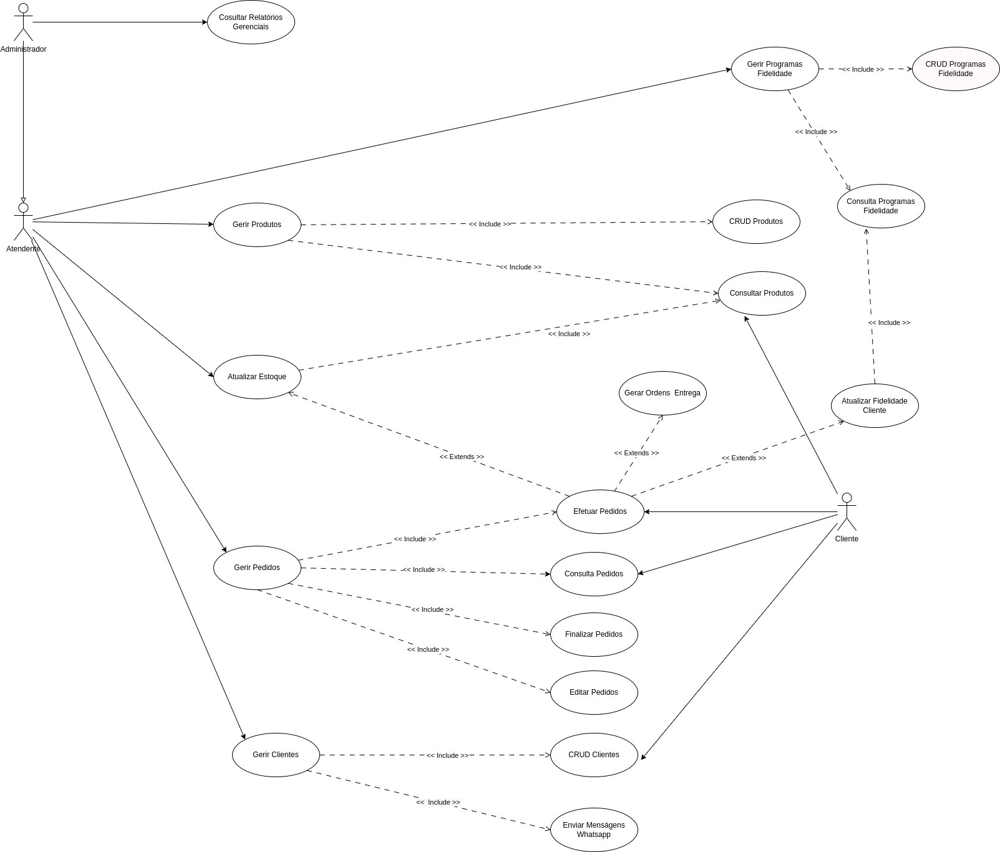

# Especificações do Projeto

## Requisitos

As tabelas que se seguem apresentam os requisitos funcionais e não funcionais que detalham o escopo do projeto. Para determinar a prioridade de requisitos, aplicar uma técnica de priorização de requisitos e detalhar como a técnica foi aplicada.

### Requisitos Funcionais

| ID     | Descrição do Requisito                                                                                          | Prioridade |
| ------ | --------------------------------------------------------------------------------------------------------------- | ---------- |
| RF-001 | A aplicação deverá permitir a criação de um perfil de usuário.                                                  | ALTA       |
| RF-002 | A aplicação deverá permitir que o administrador gerencie o relatório de compras.                                | ALTA       |
| RF-003 | A aplicação deverá permitir a alteração e a exclusão dos dados de usuários.                                     | ALTA       |
| RF-004 | A aplicação deverá permitir que os pedidos sejam ordenados por ordem de chegada, local de entrega e prioridade. | ALTA       |
| RF-005 | A aplicação deverá permitir a edição e a exclusão dos produtos.                                                 | MÉDIA      |
| RF-006 | A aplicação deverá permitir a busca de produtos com a opção de filtrar sua pesquisa.                            | ALTA       |
| RF-007 | A aplicação deverá permitir a opção de salvar o produto escolhido.                                              | BAIXA      |
| RF-008 | A aplicação deverá permitir a chegada de uma notificação a cada pedido efetuado.                                | ALTA       |
| RF-009 | A aplicação deverá permitir a visualização da quantidade e produtos em estoque.                                 | MÉDIA      |
| RF-010 | A aplicação deverá permitir que os usuários possam fazer pedidos.                                               | ALTA       |
| RF-011 | A aplicação deverá possibilitar aos usuários varias formas de pagamento ( Cartão, Dinheiro, Pix ).              | ALTA       |
| RF-012 | A aplicação deverá informar aos usuários os valores das taxas de entrega de acordo com sua localidade.          | ALTA       |
| RF-013 | A aplicação devera fidelizar os clientes mais frequente oferecendo benefícios e vantagens.                      | MÉDIA      |

### Requisitos não Funcionais

| ID      | Descrição do Requisito                                                      | Prioridade |
| ------- | --------------------------------------------------------------------------- | ---------- |
| RNF-001 | A aplicação deve ser compatível com sistemas Android e iOS.                 | ALTA       |
| RNF-002 | A aplicação deve ser responsiva para rodar em diversos dispositivos.        | ALTA       |
| RNF-003 | A aplicação deve processar requisições do usuário em no máximo 11 segundos. | BAIXA      |
| RNF-004 | A aplicação deve ser implementado utilizando React Native                   | ALTA       |

# Restrições

O projeto está restrito pelos itens apresentados na tabela a seguir.

| ID  | Restrição                                                                                                 |
| --- | --------------------------------------------------------------------------------------------------------- |
| 01  | O projeto deverá ser entregue até o final do semestre letivo, não podendo extrapolar a data de 17/12/2023 |
| 02  | O projeto poderá ser construido com base nas tecnologias desenvolvidas durante os semestres anteriores.   |
| 03  | A equipe não pode subcontratar o desenvolvimento do projeto.                                              |

## Arquitetura e Tecnologias

Descreva brevemente a arquitetura definida para o projeto e as tecnologias a serem utilizadas. Sugere-se a criação de um diagrama de componentes da solução.

## Project Model Canvas

Abaixo ilustração com o quadro Project Model Canvas

## Diagrama de Casos de Uso

O diagrama abaixo ilustra as principais ligações entre casos de uso e os atores relacionados aos requisitos funcionais levantados para o projeto.

## Modelo ER (Projeto Conceitual)

O Modelo ER representa através de um diagrama como as entidades (coisas, objetos) se relacionam entre si na aplicação interativa.

Sugestão de ferramentas para geração deste artefato: LucidChart e Draw.io.

A referência abaixo irá auxiliá-lo na geração do artefato “Modelo ER”.

> - [Como fazer um diagrama entidade relacionamento | Lucidchart](https://www.lucidchart.com/pages/pt/como-fazer-um-diagrama-entidade-relacionamento)

## Projeto da Base de Dados

O projeto da base de dados corresponde à representação das entidades e relacionamentos identificadas no Modelo ER, no formato de tabelas, com colunas e chaves primárias/estrangeiras necessárias para representar corretamente as restrições de integridade.

