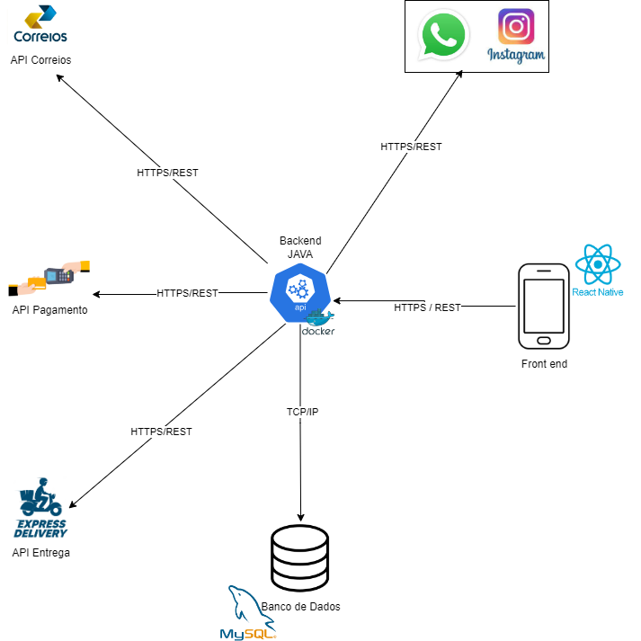

# Especificações do Projeto

## Requisitos

As tabelas que se seguem apresentam os requisitos funcionais e não funcionais que detalham o escopo do projeto. Para determinar a prioridade de requisitos, aplicar uma técnica de priorização de requisitos e detalhar como a técnica foi aplicada.

### Requisitos Funcionais

| ID     | Descrição do Requisito                                                                                          | Prioridade |
| ------ | --------------------------------------------------------------------------------------------------------------- | ---------- |
| RF-001 | A aplicação deverá permitir a criação de um perfil de usuário.                                                  | ALTA       |
| RF-002 | A aplicação deverá permitir que o administrador gerencie o relatório de compras.                                | ALTA       |
| RF-003 | A aplicação deverá permitir a alteração dos dados de usuários.                                                  | ALTA       |
| RF-004 | A aplicação deverá permitir que os pedidos sejam ordenados por ordem de chegada, local de entrega e prioridade. | ALTA       |
| RF-005 | A aplicação deverá permitir a criação, edição, e a exclusão dos produtos.                                       | MÉDIA      |
| RF-006 | A aplicação deverá permitir a busca de produtos com a opção de filtrar sua pesquisa.                            | ALTA       |
| RF-007 | A aplicação deverá permitir a opção de salvar o produto escolhido.                                              | BAIXA      |
| RF-008 | A aplicação deverá permitir a chegada de uma notificação a cada pedido efetuado.                                | ALTA       |
| RF-009 | A aplicação deverá permitir a visualização da quantidade e produtos em estoque.                                 | MÉDIA      |
| RF-010 | A aplicação deverá permitir que os usuários possam fazer pedidos.                                               | ALTA       |
| RF-011 | A aplicação deverá possibilitar aos usuários varias formas de pagamento ( Cartão, Dinheiro, Pix ).              | ALTA       |
| RF-012 | A aplicação deverá informar aos usuários os valores das taxas de entrega de acordo com sua localidade.          | ALTA       |
| RF-013 | A aplicação devera fidelizar os clientes mais frequente oferecendo benefícios e vantagens.                      | MÉDIA      |
| RF-014 | A aplicação deverá permitir que o administrador visualize a lista de clientes.                                  | MÉDIA      |
| RF-015 | A aplicação deverá permitir a exclusão de sua conta pelo usuário.                                               | ALTA       |

### Requisitos não Funcionais

| ID      | Descrição do Requisito                                                      | Prioridade |
| ------- | --------------------------------------------------------------------------- | ---------- |
| RNF-001 | A aplicação deve ser compatível com sistemas Android e iOS.                 | ALTA       |
| RNF-002 | A aplicação deve ser responsiva para rodar em diversos dispositivos.        | ALTA       |
| RNF-003 | A aplicação deve processar requisições do usuário em no máximo 11 segundos. | BAIXA      |
| RNF-004 | A aplicação deve ser implementado utilizando React Native                   | ALTA       |

# Restrições

O projeto está restrito pelos itens apresentados na tabela a seguir.

| ID  | Restrição                                                                                                 |
| --- | --------------------------------------------------------------------------------------------------------- |
| 01  | O projeto deverá ser entregue até o final do semestre letivo, não podendo extrapolar a data de 17/12/2023 |
| 02  | O projeto poderá ser construido com base nas tecnologias desenvolvidas durante os semestres anteriores.   |
| 03  | A equipe não pode subcontratar o desenvolvimento do projeto.                                              |

## Arquitetura e Tecnologias

Para atender os requisitos funcionais e não funcionais propomos a seguinte arquitetura.

# Tecnologias e Integrações

- Back End - App Java sendo executada em containers Docker.
- Front End - será desenvolvido em React Native.
- Banco de Dados - Banco de Dados Relacional MySQL.
- API de Entrega - Express Delivery para a entrega dos produtos.
- Gateway de Pagamento - em definição.
- API dos Correios - para definição do raio de CEPs atendimentos pela Ana Diniz Doceria.
- Whatsapp - para comunicação direta com o cliente.
- Instagram - para divulgação e marketing.

## Project Model Canvas

Abaixo ilustração com o quadro Project Model Canvas

## Diagrama de Casos de Uso

O diagrama abaixo ilustra as principais ligações entre casos de uso e os atores relacionados aos requisitos funcionais levantados para o projeto.

## Modelo ER (Projeto Conceitual)

O Modelo ER representa através de um diagrama como as entidades (coisas, objetos) se relacionam entre si na aplicação interativa.

## Projeto da Base de Dados

O projeto da base de dados corresponde à representação das entidades e relacionamentos identificadas no Modelo ER, no formato de tabelas, com colunas e chaves primárias/estrangeiras necessárias para representar corretamente as restrições de integridade.

### Relação de Ambientes de Trabalho
   
| Ambiente      | Plataforma                | Link de Acesso             |
|---------------|---------------------------|----------------------------|
| Repositório de Código Fonte | GitHub | https://github.com/ICEI-PUC-Minas-PMV-ADS/pmv-ads-2023-2-e5-proj-empext-t2-grupo-1-turma-2.git |
| Documentação do Projeto | GitHub | https://github.com/ICEI-PUC-Minas-PMV-ADS/pmv-ads-2023-2-e5-proj-empext-t2-grupo-1-turma-2/tree/main/docs |
| Projeto de Interface  | Canva | https://canva.com |
| Diagramas  | Draw io | https://draw.io |
| Gerenciamento do Projeto | Github | https://github.com/orgs/ICEI-PUC-Minas-PMV-ADS/projects/588/views/2 |

## Controle de Versão

A ferramenta de controle de versão escolhida para o projeto foi o Git, com o GitHub tendo sido escolhido para a hospedagem do repositório. O fluxo de trabalho do Git escolhido para o projeto foi o Gitflow (descrito em Driessen, 2010), que consiste em um modelo de organização e gerenciamento de ramificações (branches) do Git. Dentro do Gitflow, todo o desenvolvimento e manutenções no código são realizados em branches separadas, sendo elas:

     
- `main`: branch criada no início de projeto que deve conter apenas código pronto para lançamento, deve-se realizar (direta ou indiretamente) o merge de todas as outras branches à main branch quando estas houverem sido suficientemente testadas e consideradas concluídas.
- `develop`: branch criada a partir da main branch no início do projeto que contém novas funcionalidades recém produzidas, mas que ainda se encontram na fase de testes. É onde deve ser realizado o merge de novas funcionalidades desenvolvidas nas feature branches que já terminaram de ser progamadas mas ainda não foram testadas.
- `feature`: branches que devem ser criadas a partir da develop branch ao iniciar a implementação de uma nova funcionalidade. Ao completar a funcionalidade em questão, deve-se realizar o merge da feature branch em questão com a develop branch.    
- `release`: branch utilizada no processo de preparar um novo lançamento (release) do produto. É ramificada a partir da develop branch e deve ser utilizada apenas para a correção de bugs, melhoramentos em funcionalidades existentes e outras atividades relacionadas ao lançamento em questão (sem implementação de novas funcionalidades). Ao final do processo, deve ocorrer o merge desta branch com a main branch (marcando-se esta com o número da versão) e também com a develop branch.
- `hotfix`: branch ramificada diretamente da main branch que é utilizada para realizar modificações rápidas na main branch para lançamentos de produção. Uma vez concluída, deve-se realizar o merge tanto com a main branch (para implementação da modificação) quanto com a develop branch (para que as correções também estejam presentes no próximo release).
     

Tal modelo permite a correção rápida de lançamentos de produção mantendo uma linha de desenvolvimento dedicada para a atualização de segurança, deixando que a equipe trabalhe com problemas sem interromper o fluxo do trabalho ou esperar o próximo ciclo de lançamento.
     
Uma representação gráfica deste fluxo de trabalho (obtida do artigo da Atlassian encontrado na seguinte URL: https://www.atlassian.com/br/git/tutorials/comparing-workflows/gitflow-workflow) pode ser observada na figura abaixo:

 

<b>Figura </b> - Fluxo de controle do código fonte no repositório github  

 

 

A gerência de issues será feita utilizando o próprio sistema do Github dentro do repositório do projeto, adotando-se a seguinte convenção para
etiquetas:

- `documentation`: realizar mudanças na documentação
- `bug`: reportar problemas nas funcionalidades implementadas
- `enhancement`: realizar melhorias em alguma funcionalidade
- `feature`: realizar a implementação de uma nova funcionalidade

## Metodologia ágil

A equipe O Que tem pra Hoje utiliza métodos ágeis como metodologia de trabalho de acompanhamento do projeto. O método Scrum foi definido como base do processo de desenvolvimento. A equipe está organizada da seguinte maneira, conforme especificado no Project Model Canvas

A equipe trabalhará com divisões de tarefas e com encontros semanais após reunião com o P.O. para planejar e tirar dúvidas a respeito das tarefas delegadas.
Na primeira reunião de cada etapa, as tarefas serão organizadas e distribuídas.

Na segunda-feira que precede a entrega da etapa, a equipe irá se se reunir para revisar e alinhar se o que foi solicitado está pronto para ser entregue.
A Scrum Master acompanhará estas sprints (tarefas) semanalamente.

O projeto seguirá o seguinte fluxo de metodologia:

